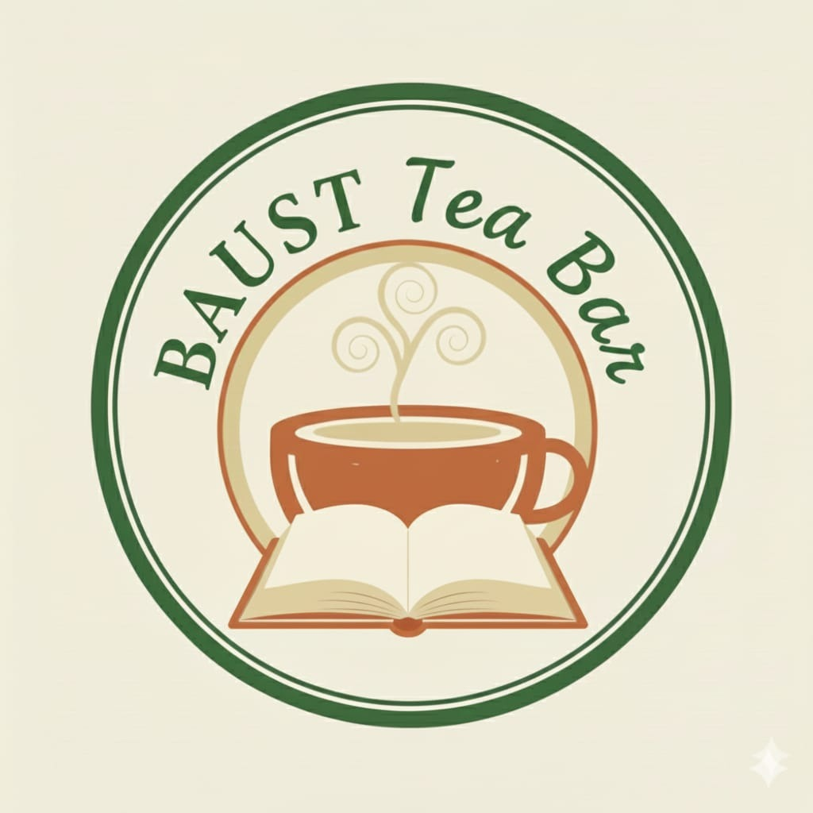

<!-- Logo on top -->
<p align="center">
  
</p>

<!-- Title centered -->
<h1 align="center" style="font-size:42px; font-weight:900; background: linear-gradient(90deg, #ff512f, #dd2476, #1e90ff); -webkit-background-clip: text; -webkit-text-fill-color: transparent; text-shadow: 2px 2px 8px rgba(0,0,0,0.2);">
  ☕ BAUST TEA BAR ☕
</h1>
<h3 align="center">
  <b style="color:purple;">🍽️ A Secure Food & Tea Ordering & Management Platform for BAUST Faculty and Authority</b>
</h3>

<p align="center">
  
  
  
  
  
  
</p>

<p align="center">
  <a href="https://baust-tea-bar-psi.vercel.app" target="_blank">
    
  </a>
  <a href="https://github.com/Gaurab1809/BAUST-TEA-BAR">
    
  </a>
</p>


<!-- Abstract Banner -->


**BAUST TEA BAR** is a secure, full-stack, web-based **food and tea ordering and service management system** developed exclusively for BAUST faculty and authority. It digitizes the entire on-campus tea and food ordering process — from placing orders to tracking monthly bills — through a modern, role-based interface with real-time updates, email notifications, dark mode support, and a fully responsive design.

**Keywords:** BAUST TEA BAR, food ordering system, faculty portal, institutional cafeteria system, digital ordering platform, React, Express, Firebase, SQLite, TypeScript.


<!-- Introduction Banner -->


Traditional food ordering systems in institutional environments are often slow, paper-based, and prone to errors. **BAUST TEA BAR** solves this by providing a fully digital, centralized, and secure ordering platform tailored specifically for BAUST's internal operations.

The system runs with a **Vite + React 18** frontend communicating with an **Express.js** backend via a proxied API. Authentication is handled by **Firebase**, while persistent data is stored across both **Firestore** and **SQLite**. The entire project is written in **TypeScript (95.5%)**, tested with **Vitest**, and deployed on **Vercel**.

**BAUST TEA BAR** solves this by providing:

- 🍽️ Fully digitized, centralized ordering system  
- 🔐 Secure, role-based access control (Admin / Top Management / Faculty)  
- ⚡ Fast, real-time order tracking and notifications  
- 🌙 Dark mode with system preference detection  
- 📱 Fully responsive and mobile-friendly UI  
- 📧 Email notification system via Nodemailer  
- 🧪 Unit-tested codebase with Vitest  


<!-- System Modules Banner -->


### 🔐 Admin Module
- 👤 Create, update, and delete system users  
- 🧾 Monitor and manage all orders in real-time  
- 🍽️ Add, update, and remove menu items  
- 📊 View detailed order reports and system statistics  
- 🔔 Send notifications and order status updates  
- 🗄️ Full control over both Firestore and SQLite data  

### 👑 Top Management Module
- 👁️ Read-only access to all admin activities and system data  
- 🖨️ Print and export order reports and statistics directly  
- 📊 Monitor system-wide performance, order volumes, and service metrics  
- 🚫 No permission to create, edit, or delete any records — view only  

### 👥 Faculty / Authority Module
- 🧋 Browse and place tea, snack, and food orders  
- 📖 View personal order history  
- 💰 Track monthly bill / running tab  
- 🔔 Receive real-time order status updates  
- ⚙️ Manage personal profile settings  


<!-- Purpose Banner -->


The purpose of **BAUST TEA BAR** is to:

- 🍽️ Fully digitize and streamline on-campus food and tea ordering  
- ⚡ Eliminate manual processing delays and paperwork  
- 🔐 Ensure secure, role-based and controlled access to the system  
- 📊 Improve service efficiency with real-time tracking and notifications  
- 💰 Enable transparent monthly billing and order history for all users  
- 🏫 Serve BAUST faculty, authority, and management from a single platform  


<!-- Key Features Banner -->


- 🍵 Tea, snacks, and food ordering system  
- 🔐 Role-based access control — Admin, Top Management, Faculty  
- 🌙 Dark mode with automatic system preference detection  
- ⚡ Fast, responsive UI powered by Vite + SWC  
- 🧾 Real-time order tracking and status updates  
- 📧 Email notifications via Nodemailer  
- 💰 Monthly bill tracking per user  
- 📱 Fully mobile-friendly and responsive interface  
- 🔔 Toast notifications via Sonner  
- 🧑‍💼 Full admin dashboard with user, menu, and order management  
- 👑 Top Management read-only dashboard with print & export  
- 🖨️ Report printing and export for Top Management  
- 🧪 Unit-tested codebase using Vitest + Testing Library  
- 🔒 JWT authentication with bcryptjs password hashing  
- 🗄️ Dual database architecture — Firebase Firestore + SQLite  
- 📅 Date-based order filtering with date-fns  
- 🎨 Custom tea-themed color palette (warm, light, cream, dark)  
- 🖋️ Typography with Playfair Display headings and Inter body font  
- 🎛️ Full shadcn/ui component library with Radix UI primitives  


<!-- User Roles Banner -->


<div align="center">

| Role | Create | Read | Update | Delete | Print/Export |
|:----:|:------:|:----:|:------:|:------:|:------------:|
| **Admin** | ✅ | ✅ | ✅ | ✅ | ✅ |
| **Top Management** | ❌ | ✅ | ❌ | ❌ | ✅ |
| **Faculty / Authority** | ✅ (orders only) | ✅ (own data) | ✅ (profile) | ❌ | ❌ |

</div>

### 🔐 Admin
- 👮 Create, update, and delete system users  
- 🧾 Monitor and manage all orders  
- 🍽️ Full menu management (add / edit / remove items)  
- 📊 View and manage all system reports  
- 🔔 Send order status notifications  

### 👑 Top Management
- 👁️ View all admin activities in read-only mode  
- 🖨️ Print and export reports directly from the dashboard  
- 📊 Monitor system-wide order statistics and service performance  
- 🚫 Strictly no permission to create, modify, or delete any data  

### 🎓 Faculty / Authority
- 🧑‍💻 Browse menu and place food & tea orders  
- 📖 View personal order history and status  
- 💰 Track monthly bills and running tab  
- 🔔 Receive real-time order updates  
- ⚙️ Manage personal profile  


<!-- Tech Stack Banner -->


### 💻 Frontend
<div align="center">

| Technology | Purpose |
|:----------:|:-------:|
| React 18 | UI framework |
| TypeScript | Strongly-typed language |
| Vite + SWC | Lightning-fast build tool and compiler |
| Tailwind CSS | Utility-first CSS framework |
| shadcn/ui | Accessible component library |
| Radix UI | Headless UI primitives |
| TanStack Query v5 | Server state management and caching |
| React Router DOM v6 | Client-side routing |
| React Hook Form + Zod | Form handling and validation |
| Sonner | Toast notifications |
| Lucide React | Icon library |
| date-fns | Date manipulation |
| Embla Carousel | Carousel component |
| next-themes | Dark / light mode |
| Playfair Display + Inter | Custom typography |

</div>

### 🖥️ Backend
<div align="center">

| Technology | Purpose |
|:----------:|:-------:|
| Express.js v5 | REST API server |
| Node.js | Runtime environment |
| Firebase Admin SDK | Auth and Firestore access |
| SQLite3 | Local relational database |
| JWT (jsonwebtoken) | Token-based authentication |
| bcryptjs | Password hashing |
| Nodemailer | Email notifications |
| express-validator | Request validation |
| cors | Cross-origin resource sharing |
| dotenv | Environment variable management |

</div>

### 🧪 Testing & Dev Tools
<div align="center">

| Technology | Purpose |
|:----------:|:-------:|
| Vitest | Unit test framework |
| Testing Library | React component testing |
| jsdom | DOM simulation for tests |
| ESLint | Code linting |
| concurrently | Runs Vite and Express simultaneously |

</div>


<!-- Operating Environment Banner -->


- 🌐 Platform: Web-based (SPA)  
- 🏗️ Architecture: Client-Server (REST API)  
- 🆔 Authentication: Firebase Auth + JWT + bcryptjs  
- 💻 Frontend: React 18 / TypeScript / Tailwind CSS / shadcn/ui  
- 🖥️ Backend: Express.js v5 / Node.js  
- 🗄️ Database: Firebase Firestore (cloud) + SQLite (local relational)  
- 📧 Email: Nodemailer  
- 🚀 Deployment: Vercel (frontend) — SPA rewrites configured  
- 🔧 Dev Server: Vite (port 8080) proxying to Express (port 3000)  
- 🖥️ OS: Cross-platform  


<!-- Project Structure Banner -->


```
BAUST-TEA-BAR/
├── backend/              # Express.js API server
│   └── server.js         # Main server entry point
├── public/               # Static public assets
├── scratch/              # Development scratch files
├── src/                  # React frontend source
│   ├── assets/           # Images and static assets
│   ├── components/       # Reusable UI components (shadcn/ui)
│   ├── hooks/            # Custom React hooks
│   ├── lib/              # Utilities and helpers
│   └── main.tsx          # Frontend entry point
├── index.html            # App HTML shell with dark mode init
├── package.json          # Dependencies and scripts
├── tailwind.config.ts    # Custom theme (tea palette, fonts)
├── vite.config.ts        # Vite config with API proxy
├── vitest.config.ts      # Test configuration
├── tsconfig.json         # TypeScript configuration
├── components.json       # shadcn/ui configuration
└── vercel.json           # Vercel SPA rewrite rules
```


<!-- Getting Started Banner -->


### Prerequisites
- 🟢 Node.js (v18+)  
- 📦 npm or bun  
- 🔥 Firebase project with Firestore enabled  
- 📧 SMTP credentials for Nodemailer (email notifications)  

### Installation

**1. Clone the repository**
```bash
git clone https://github.com/Gaurab1809/BAUST-TEA-BAR.git
cd BAUST-TEA-BAR
```

**2. Install dependencies**
```bash
npm install
```

**3. Configure environment variables**

Create a `.env` file in the root and backend directories:
```env
# Firebase
VITE_FIREBASE_API_KEY=your_api_key
VITE_FIREBASE_AUTH_DOMAIN=your_auth_domain
VITE_FIREBASE_PROJECT_ID=your_project_id

# Backend (JWT + Email)
JWT_SECRET=your_jwt_secret
EMAIL_USER=your_email
EMAIL_PASS=your_email_password
```

**4. Run the development server**
```bash
npm run dev
```
> This command uses `concurrently` to run **Vite (port 8080)** and **Express (port 3000)** simultaneously.

### Available Scripts
<div align="center">

| Script | Description |
|:------:|:-----------:|
| `npm run dev` | Start Vite frontend + Express backend together |
| `npm run build` | Production build |
| `npm run build:dev` | Development mode build |
| `npm run preview` | Preview production build |
| `npm run lint` | Run ESLint |
| `npm run test` | Run Vitest tests once |
| `npm run test:watch` | Run Vitest in watch mode |

</div>


<!-- Language Stats Banner -->


<div align="center">

| Language | Percentage |
|:--------:|:----------:|
| TypeScript | 95.5% |
| JavaScript | 2.9% |
| CSS | 1.2% |
| HTML | 0.4% |

</div>


<!-- Conclusion Banner -->


**BAUST TEA BAR** is a production-ready, full-stack institutional food ordering platform built with a modern TypeScript-first stack. It brings together a carefully designed role hierarchy, real-time data flow, dual-database architecture, and a polished UI — all deployed live on Vercel.

It ensures:
- 🍽️ Fully centralized, digital ordering  
- ⚡ Fast service delivery with real-time updates  
- 🔐 Secure, role-based access control with JWT + Firebase  
- 📊 Transparent management with a read-only Top Management oversight layer  
- 🧪 Reliable, tested codebase for long-term maintainability  


<!-- Author Banner -->


**A. K. M. Masudur Rahman (Gaurab)**  
🎓 Department of Computer Science and Engineering (CSE)  
🏫 Bangladesh Army University of Science and Technology (BAUST), Saidpur  
🐙 GitHub: [@Gaurab1809](https://github.com/Gaurab1809)  


<!-- Support Banner -->


If you like this project, give it a ⭐ on [GitHub](https://github.com/Gaurab1809/BAUST-TEA-BAR)!

<p align="center">
  <a href="https://github.com/Gaurab1809/BAUST-TEA-BAR">
    
  </a>
  <a href="https://github.com/Gaurab1809/BAUST-TEA-BAR/fork">
    
  </a>
</p>
